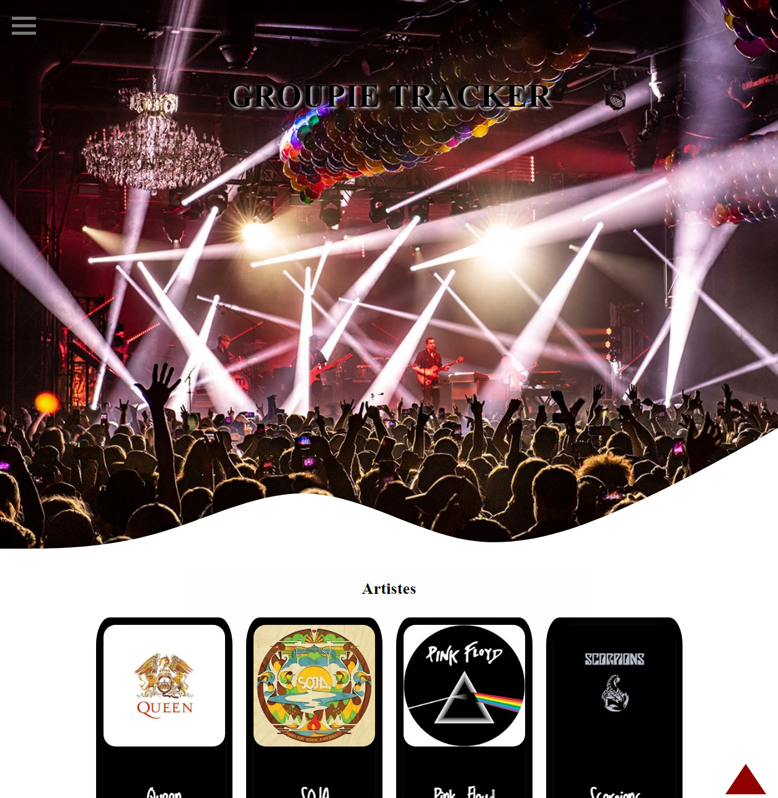
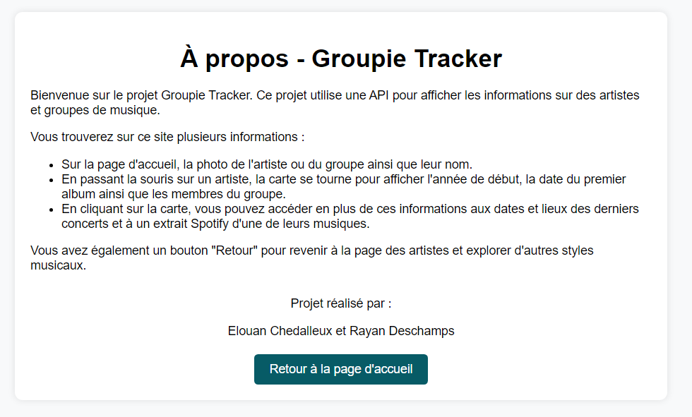
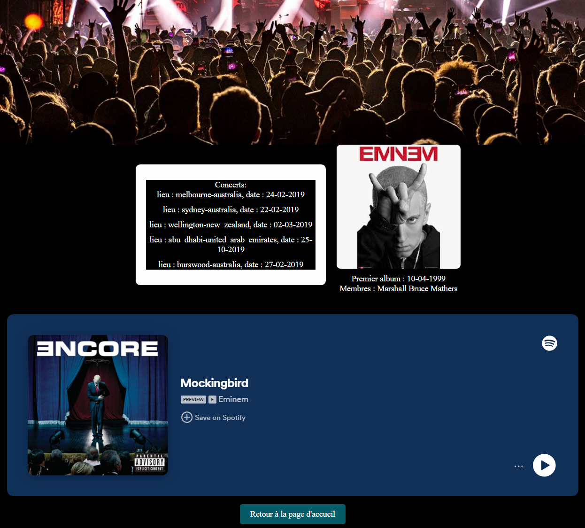

# Groupie Tracker

## Introduction

Bienvenue sur le groupie-tracker, un site d'affichage de site web.

## Prérequis

Avant de commencer, assurez-vous d'avoir les éléments suivants installés sur votre système :

- Go (Golang) : [Télécharger et installer Go](https://golang.org/dl/)
- Makefile : [D'abord : Set-ExecutionPolicy Bypass -Scope Process -Force; [System.Net.ServicePointManager]::SecurityProtocol = [System.Net.ServicePointManager]::SecurityProtocol -bor 3072; iex ((New-Object System.Net.WebClient).DownloadString('https://community.chocolatey.org/install.ps1'))  // Puis : choco install make]

## Démarrage du Programme

Pour démarrer le serveur suivez ces étapes simples :

- `make build` (permet de compiler ) 
    - `make run`
    - Ensuite, saisissez dans la barre de recherche Google : localhost:8080 OU cliquer sur le lien qui s'affiche dans le terminal

- `make restart` afin de clean, build et run après avoir fais des modifications.

/!\ ATTENTION : ne pas modifier les fichiers, sinon il peut y avoir des problèmes dans l'execution du programme.

Pour afficher l'aide :
- `.\groupie-tracker.exe -h`

Pour éteindre le jeu :
- `Ctrl+C` pour éteindre le serveur,
    - `make clean` pour nettoyer les fichiers compilé.

## Remerciements 

Merci d'avoir essayé ce programme, en espérant qu'il n'y ait eu aucun souci.

# Groupie-Tracker - Documentation

Projet réalisé en binôme.

## Sommaire
I. [Rappel du Projet](#i-rappel-du-projet)  
II. [Cadre de développement](#ii-cadre-de-développement)  
III. [Stack Technique](#iii-stack-technique)  
IV. [Comment installer le projet](#iv-comment-installer-le-projet)  
V. [Utilisation](#v-utilisation)  
VI.[Axes d'améliorations](#vi-axes-damélioration)  
VII. [Visuels de l'application web](#vii-Visuels-de-lapplication-web) 
VIII. [Remerciements](#viii-remerciements)  

## I. Rappel du Projet

Le projet a pour objectif de concevoir un **Groupie Tracker**, une application dédiée à la gestion et à la visualisation des informations concernant des groupes musicaux. Les éléments principaux du projet sont les suivants :

- **Affichage d'API** : Création d'interfaces permettant d'interagir avec des bases de données pour récupérer des informations sur les groupes.

- **Groupes d'artistes** : Les groupes ou ensembles musicaux doivent être listés, avec des détails sur leurs membres.

- **Membres des groupes** : Pour chaque groupe, il est nécessaire d'afficher les noms des personnes qui le composent.

- **Lieux de concerts** : Les informations sur les lieux où les groupes se produisent doivent être incluses.
- **Dates des concerts** : Les dates précises des concerts doivent être disponibles pour chaque groupe.

En résumé, le Groupie Tracker doit permettre aux utilisateurs de suivre les concerts de leurs groupes préférés, de connaître les membres des groupes et de consulter les détails pertinents sur chaque événement.

## II. Cadre de développement

- **Établissement** : Rennes Ynov Campus
- **Niveau d'études** : Première année en Bachelor Informatique
- **Contraintes** :
    * **Durée du projet** : 1 mois
    * **Objectif principal** : Développer une application web pour le Groupie Tracker
    * **Fonctionnalités requises** :
        - Affichage des groupes d'artistes avec les détails sur les membres
        - Visualisation des lieux et dates des concerts pour chaque groupe
        - Interface utilisateur intuitive pour la consultation et la recherche d'informations
        - Intégration d'API pour récupérer et afficher les données en temps réel

## III. Stack Technique

- **Langages** : Golang, HTML/CSS et JavaScript

## IV. Comment installer le projet

### 1 - Prérequis

Installer Make et Golang

### 2 - Cloner le répertoire

Placez-vous dans le dossier où vous souhaitez avoir le projet.
Ouvrez ensuite vôtre cmd, VisualStudioCode, ou votre IDE habituel, puis utilisez la commande ``git clone https://github.com/Elouanche/Groupie_Tracker.git``.

## V. Utilisation

Sasissez à la racine du projet : **make build** puis **make run** afin de compiler et lancer le projet. 
Une fois le jeu essayé, n'oublier pas d'utiliser **make clean**.
Si votre projet est compilé et que vous souhaitez restart le jeu vous pouvez faire : **make restart**.

## VI. Axes d'amélioration

   - Ajouter l'API spotify afin d'avoir la derniere musique publié de l'artiste ou celle avec le plus d'écoute.
   - Améliorer l'UI/UX.

## VII. Visuels de l'application web

## VIII. Remerciements

Nous vous remercions d'avoir essayé notre projet en espérant que cela vous a plu !
